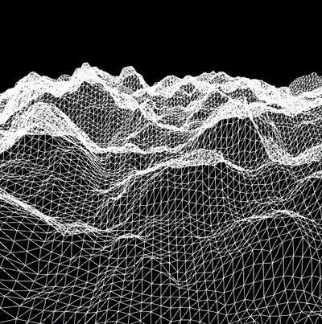

# terrain

A Clojure/Quil implementation of the Terrain simulation coding
challenge presented here:

[https://www.youtube.com/watch?v=IKB1hWWedMk](https://www.youtube.com/watch?v=IKB1hWWedMk)

## Usage

Here is how the simulation looks like:

]

```
lein run
# then press CTRL-C to stop.
```

## License

Copyright © 2018 Bruno Bonacci - Distributed under the [Apache License v2.0](http://www.apache.org/licenses/LICENSE-2.0)
